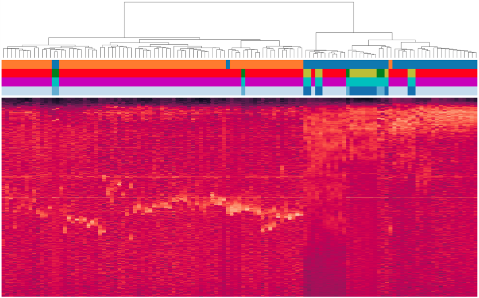

# ultra-sonic-vocalizations
Python package for audio and machine learning analysis of audible and ultra-sonic vocalizations.

TO DO:

devops
1. Add condaz ffmpeg+ffprobe installation in docker image
2. Write python package setup file

dataset
0. Recheck audio lengths
1. Extend dataframe types accepted in dataset creation
2. Write exporting functions
3. Write stratified sampling method

stats
1. full dataset events classification
2. full dataset events hierarchical clustering

