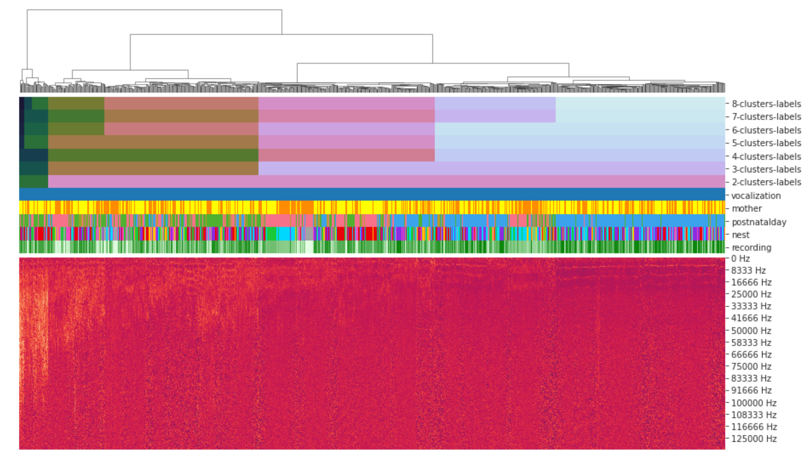

# ultra-sonic-vocalizations
Python scripts package for audio and machine learning analysis of audible and ultra-sonic vocalizations.

TO DO:

devops
1. Add conda ffmpeg+ffprobe installation in docker image
2. Write python package setup file
3. Tests :/

dataset / stats
1. Write stratified sampling method
